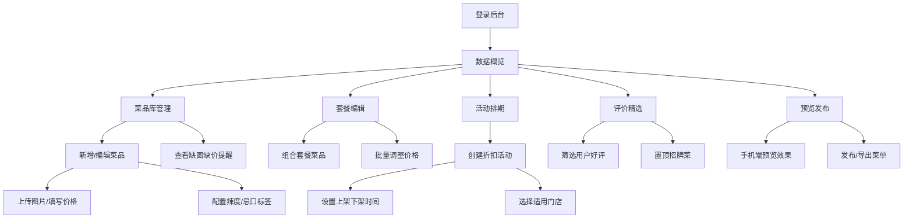

## 1. 产品概述

餐饮美食平台管理后台，面向餐厅运营人员，提供菜单维护、活动上新、数据监控等一体化管理能力。通过直观的可视化界面，帮助运营人员高效管理菜品库、套餐组合、营销活动和用户评价，提升餐厅数字化运营效率。

## 2. 核心功能

### 2.1 用户角色

| 角色 | 登录方式 | 核心权限 |
|------|----------|----------|
| 餐厅运营人员 | 账号登录 | 菜品管理、套餐配置、活动排期、数据查看、预览发布 |

### 2.2 功能模块

1. **数据概览**：核心数据指标卡、浏览/收藏趋势图表、门店经营概览
2. **菜品库**：菜品列表、新增/编辑菜品、多图上传、价格分量、辣度与忌口标签、缺图缺价提醒
3. **套餐编辑**：套餐列表、组合套餐、批量调价、套餐菜品配置
4. **口味标签**：标签分类管理、辣度等级、忌口选项、标签绑定
5. **库存展示**：库存总览、限量设置、库存预警、上下架状态
6. **活动排期**：活动列表、新品折扣、上架下架时间、门店选择、活动状态管理
7. **评价精选**：用户评价列表、好评筛选、置顶招牌菜、评价回复
8. **预览发布**：手机端预览、菜单预览、发布确认、版本管理

### 2.3 页面详情

| 页面名称 | 模块名称 | 功能描述 |
|----------|----------|----------|
| 数据概览 | 指标卡片 | 展示菜品总数、在售菜品、今日浏览量、收藏量等核心指标 |
| 数据概览 | 趋势图表 | 浏览量和收藏量的近7天/30天趋势折线图 |
| 数据概览 | 门店概览 | 各门店的菜品数量和销售情况一览 |
| 菜品库 | 菜品列表 | 菜品卡片展示，支持搜索、分类筛选、排序 |
| 菜品库 | 新增/编辑菜品 | 表单填写菜品信息，支持多图上传、价格分量设置 |
| 菜品库 | 标签配置 | 辣度等级、忌口标签的选择和配置 |
| 菜品库 | 缺图缺价提示 | 高亮显示缺少图片或价格的菜品，提醒运营补全 |
| 菜品库 | 批量操作 | 批量调整价格、批量上下架、批量导出 |
| 套餐编辑 | 套餐列表 | 套餐卡片展示，显示套餐包含菜品和价格 |
| 套餐编辑 | 组合套餐 | 从菜品库选择菜品组合成套餐，设置套餐价 |
| 套餐编辑 | 批量调价 | 按比例或固定金额批量调整套餐价格 |
| 口味标签 | 标签分类 | 辣度、忌口、食材等标签分类管理 |
| 口味标签 | 标签管理 | 新增、编辑、删除标签，设置标签颜色和图标 |
| 库存展示 | 库存总览 | 各菜品库存数量、预警阈值、状态标识 |
| 库存展示 | 限量设置 | 设置每日限量、售罄提示 |
| 活动排期 | 活动列表 | 活动时间轴展示，显示活动状态 |
| 活动排期 | 新建活动 | 设置活动名称、折扣、时间范围、适用门店 |
| 活动排期 | 上架下架 | 定时上架下架、手动切换状态 |
| 评价精选 | 评价列表 | 用户评价展示，支持按评分、时间筛选 |
| 评价精选 | 好评筛选 | 筛选4-5星好评，标记精选 |
| 评价精选 | 招牌菜置顶 | 设置招牌菜品并置顶展示 |
| 预览发布 | 手机端预览 | 模拟手机端菜单展示效果 |
| 预览发布 | 发布管理 | 预览版本、发布确认、发布历史 |
| 预览发布 | 导出清单 | 导出菜单清单为Excel/CSV文件 |

## 3. 核心流程

运营人员登录后台后，可在菜品库中新增和维护菜品信息，配置口味标签和价格；通过套餐编辑功能组合菜品成套餐并设置优惠价；在库存展示中设置限量库存和预警阈值；通过活动排期安排新品折扣和上下架时间；在评价精选中筛选优质评价并置顶招牌菜；最后通过预览发布功能查看手机端效果并发布，同时可导出菜单清单。

## 4. 用户界面设计

### 4.1 设计风格
- **主色调**：暖橙色（#FF7A2D），传递美食的温暖与活力
- **辅助色**：深棕色（#3E2723），增添质感与专业感
- **中性色**：米白背景（#FFFAF5）、深灰文字（#2D2A26）、浅灰边框（#E8E0D8）
- **强调色**：成功绿（#2ECC71）、警示红（#E74C3C）、信息蓝（#3498DB）
- **按钮风格**：圆角胶囊按钮，主按钮渐变填充，悬停有微缩放效果
- **字体**：标题使用思源黑体 Bold，正文使用思源黑体 Regular，数字等宽字体
- **布局风格**：左侧固定导航栏 + 右侧内容区，卡片式布局，圆角12px
- **图标风格**：线性图标，2px描边，与主色调一致

### 4.2 页面设计概览

| 页面名称 | 模块名称 | UI 元素 |
|----------|----------|---------|
| 数据概览 | 指标卡片 | 渐变背景、大数字、趋势箭头、图标装饰 |
| 数据概览 | 趋势图表 | 平滑折线图、渐变填充、双Y轴、时间筛选 |
| 菜品库 | 菜品卡片 | 图片占位角标、标签色块、价格高亮、操作按钮 |
| 菜品库 | 编辑表单 | 分组标题、图片上传区、标签选择器、数字输入框 |
| 套餐编辑 | 套餐组合 | 拖拽排序、菜品选择器、价格计算器 |
| 活动排期 | 时间轴 | 垂直时间线、活动状态色标、日期标签 |
| 评价精选 | 评价卡片 | 用户头像、星级评分、评价内容、精选徽章 |
| 预览发布 | 手机预览 | 手机边框、模拟状态栏、可滚动内容区 |

### 4.3 响应式
- 桌面端优先设计（1280px 及以上）
- 左侧导航固定宽度 240px
- 内容区最小宽度 960px，支持横向滚动
- 平板端（768-1279px）导航可折叠
- 移动端（< 768px）顶栏导航 + 抽屉菜单

### 4.4 动效设计
- 页面切换：淡入淡出 + 轻微上移动画
- 卡片悬停：上移 2px + 阴影加深
- 按钮交互：0.15s 缩放 + 颜色过渡
- 数据加载：骨架屏脉冲动画
- 标签切换：底部滑块滑动过渡
- 表单校验：错误提示抖动动画
