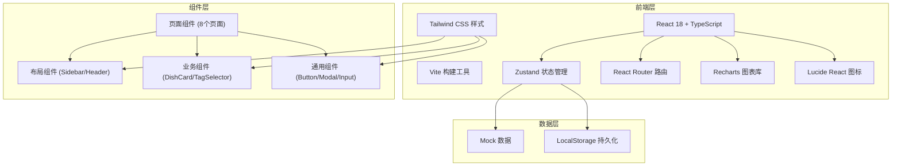
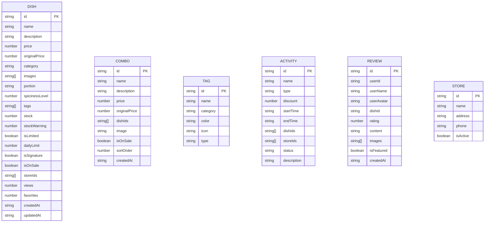

## 1. 架构设计



## 2. 技术描述

- **前端框架**：React 18 + TypeScript
- **构建工具**：Vite 5
- **样式方案**：Tailwind CSS 3
- **状态管理**：Zustand 4
- **路由管理**：React Router DOM 6
- **图表库**：Recharts 2
- **图标库**：Lucide React
- **数据方式**：前端 Mock 数据 + LocalStorage 持久化
- **初始化工具**：vite-init

## 3. 路由定义

| 路由 | 页面名称 | 功能描述 |
|------|----------|----------|
| /dashboard | 数据概览 | 核心指标、趋势图表、门店概览 |
| /dishes | 菜品库 | 菜品列表、新增编辑、标签配置、缺图缺价提示 |
| /combos | 套餐编辑 | 套餐列表、组合套餐、批量调价 |
| /tags | 口味标签 | 标签分类、标签管理 |
| /inventory | 库存展示 | 库存总览、限量设置 |
| /activities | 活动排期 | 活动列表、新建活动、上下架管理 |
| /reviews | 评价精选 | 评价列表、好评筛选、招牌菜置顶 |
| /preview | 预览发布 | 手机端预览、发布管理、导出清单 |

## 4. 数据模型

### 4.1 数据模型定义



### 4.2 状态管理结构

- **dishStore**：菜品数据管理（CRUD、筛选、批量操作）
- **comboStore**：套餐数据管理
- **tagStore**：标签数据管理
- **activityStore**：活动数据管理
- **reviewStore**：评价数据管理
- **storeStore**：门店数据管理
- **uiStore**：UI 状态管理（侧边栏、弹窗等）

## 5. 项目结构

```
src/
├── components/          # 通用组件
│   ├── Layout/         # 布局组件
│   │   ├── Sidebar.tsx
│   │   ├── Header.tsx
│   │   └── index.tsx
│   ├── ui/             # 基础UI组件
│   │   ├── Button.tsx
│   │   ├── Modal.tsx
│   │   ├── Input.tsx
│   │   ├── Tag.tsx
│   │   ├── Card.tsx
│   │   └── Table.tsx
│   └── business/       # 业务组件
│       ├── DishCard.tsx
│       ├── DishForm.tsx
│       ├── TagSelector.tsx
│       ├── ImageUploader.tsx
│       └── PhonePreview.tsx
├── pages/              # 页面组件
│   ├── Dashboard.tsx
│   ├── Dishes.tsx
│   ├── Combos.tsx
│   ├── Tags.tsx
│   ├── Inventory.tsx
│   ├── Activities.tsx
│   ├── Reviews.tsx
│   └── Preview.tsx
├── store/              # 状态管理
│   ├── dishStore.ts
│   ├── comboStore.ts
│   ├── tagStore.ts
│   ├── activityStore.ts
│   ├── reviewStore.ts
│   └── storeStore.ts
├── data/               # Mock数据
│   ├── dishes.ts
│   ├── combos.ts
│   ├── tags.ts
│   ├── activities.ts
│   ├── reviews.ts
│   └── stores.ts
├── types/              # 类型定义
│   └── index.ts
├── utils/              # 工具函数
│   ├── format.ts
│   ├── export.ts
│   └── storage.ts
├── App.tsx
├── main.tsx
└── index.css
```
